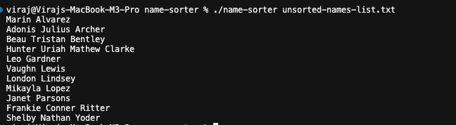
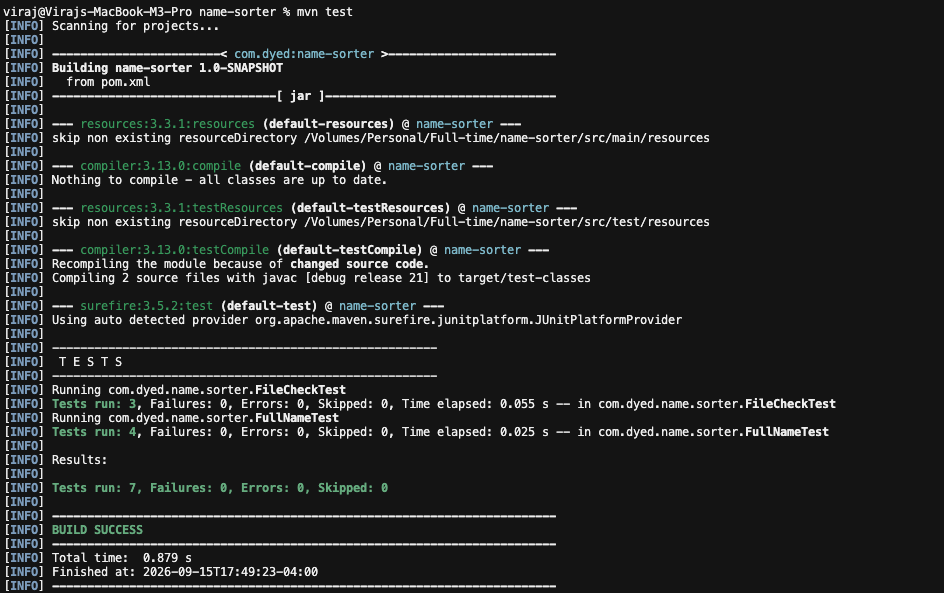
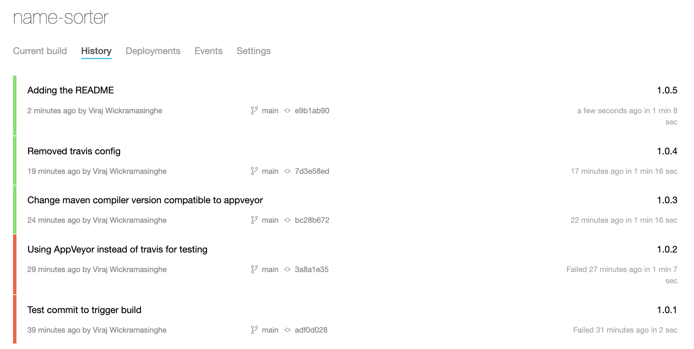

# name-sorter project

Java app that sorts names by last name, then given names. Names must have 1–3 given names and one last name.

GitHub: https://github.com/vjanu/name-sorter  
Build pipeline: https://ci.appveyor.com/project/vjanu/name-sorter

## Run

```shell
./name-sorter ./unsorted-names-list.txt
```
Prints sorted names and writes `sorted-names-list.txt`.



## Test

```shell
mvn test
```


## Classes

| Class | What it does |
|---|---|
| `FullName` | Holds a name (last + given). Parses a line then validates and prints  |
| `LastNameSorter` | Sorts a list of names by last name, then given names |
| `NameFiles` | Reads and writes the name list files |
| `NameSorter` | Entry point |

## Design

- Classes were split this way so each class has one job (Single Responsibility Principle).`NameSorter` only provides the entry point to start the app, `LastNameSorter` only sorts, `NameFiles` only touches the input/output file.
- Sort order is in `LastNameSorter.compare` and name format is in `FullName.parse`. You can change one without touching the other (Open/Closed Principle).

## Tests

`FileCheckTest` - tests that the file exists, can be read, and can be written to  
`FullNameTest` - tests that names are sorted correctly and invalid names are rejected

## Builds


Latest Build: https://ci.appveyor.com/project/vjanu/name-sorter/builds/54728930
